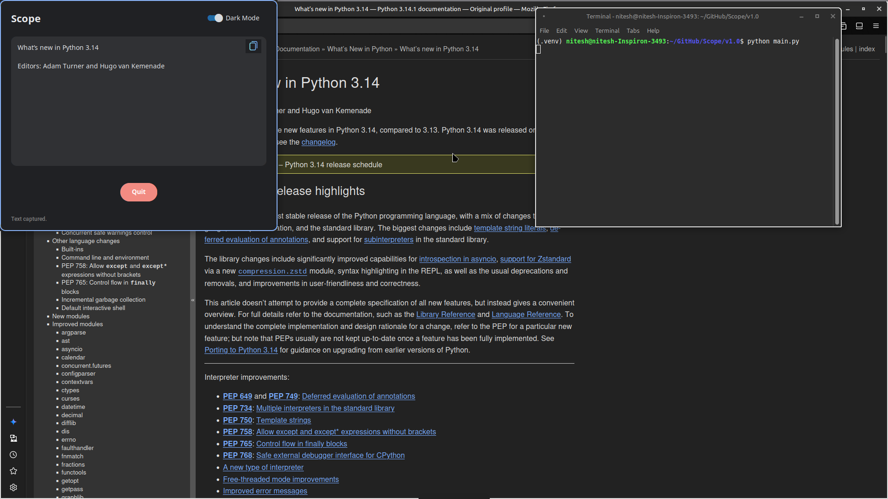

# Scope


Scope is a lightweight Python application that allows users to select a region on their screen, extract text from it using OCR (Optical Character Recognition), and display the result in a modern, customizable popup window.

## Screenshots




## Features

-   **Region Selection**: Select any part of your screen to capture text.
-   **OCR Integration**: Uses Tesseract OCR to accurately extract text from images.
-   **Modern UI**: Built with CustomTkinter for a sleek, modern look.
-   **Theme Support**: Toggle between Dark and Light modes.
-   **Clipboard Integration**: One-click button to copy extracted text to your clipboard.
-   **Draggable Window**: Headerless window design that can be dragged anywhere on the screen.

## Prerequisites

Before running Scope, ensure you have the following system tools installed (for Linux):

-   `slop` (Screen selection)
-   `maim` (Screenshot utility)
-   `tesseract` (OCR engine)
-   `xclip` (Clipboard utility)

You can install these on Ubuntu/Debian based systems via:

```bash
sudo apt install slop maim tesseract-ocr xclip
```

## Installation

1.  Clone the repository:
    ```bash
    git clone https://github.com/yourusername/Scope.git
    cd Scope
    ```

2.  Install the required Python packages:
    ```bash
    pip install customtkinter Pillow pyperclip plyer
    ```

## Usage

Run the application using Python:

```bash
python3 main.py
```

1.  Upon execution, your cursor will change to a crosshair.
2.  Click and drag to select the region containing the text you want to extract.
3.  A popup window will appear with the extracted text.
4.  Use the **Copy** button to copy the text to your clipboard.
5.  Click **Quit** to close the application.

## Configuration

-   **Theme**: Use the toggle switch in the top right corner to switch between Dark and Light modes.
